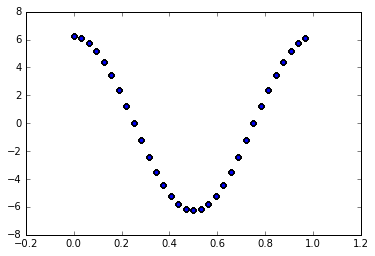
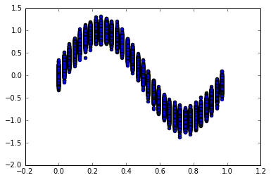
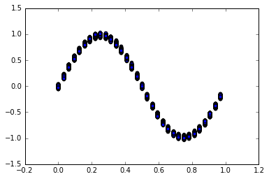

# MESHOID: MESHless Operations such as Integrals and Derivatives
"It's not a mesh; it's a meshoid!" - Alfred B. Einstimes

## Installation
Put a symlink to meshoid.py wherever your python modules are. Usually ends with site-packages.

This module requires numpy, scipy and numba.

## Walkthrough
Let's take it for a spin. First let's import meshoid and the usual modules.


```python
import numpy as np
from meshoid import meshoid
from matplotlib import pyplot as plt
%matplotlib inline
```

Let's make a regular grid in the unit cube as a test case. Then we'll make a meshoid out of those points with periodic boundaries.


```python
x = np.arange(0,1,1./32)
x,y,z = np.meshgrid(x,x,x)
x = np.c_[x.flatten(),y.flatten(),z.flatten()] #generate the points on a uniform grid; these point positions are arbitrary!
m = meshoid(x, des_ngb=32, boxsize=1.0) # make the meshoid for unit cube with periodic BCs
```

Here we specified the boxsize because we want periodic BCs. We also specified des_ngb=32, which is the number of nearest neighbours used for kernel calculations. This defaults to 32 for the 3D case in both meshoid and GIZMO.

The meshoid makes a kd-tree out of the points and uses it to find the nearest neighbors of each point, their distances, and the smoothing length and density as calculated by GIZMO:


```python
#indices of nearest neighbors
print(m.ngb)
#distances to nearest neighbors
print(m.ngbdist)
#smoothing lengths 
print(m.h)
#particle densities
print(m.density)
```

    [[    0  1024 31744 ...,  2048   960    30]
     [    1     2  1025 ...,    65  2049   961]
     [    2 31746    34 ...,  2050     4   962]
     ..., 
     [32765 31741 32733 ..., 32701 32763  2045]
     [32766 32765 32734 ..., 32702  2046 32764]
     [32767 31775 32735 ..., 30719 32737  2047]]
    [[ 0.       0.03125  0.03125 ...,  0.0625   0.0625   0.0625 ]
     [ 0.       0.03125  0.03125 ...,  0.0625   0.0625   0.0625 ]
     [ 0.       0.03125  0.03125 ...,  0.0625   0.0625   0.0625 ]
     ..., 
     [ 0.       0.03125  0.03125 ...,  0.0625   0.0625   0.0625 ]
     [ 0.       0.03125  0.03125 ...,  0.0625   0.0625   0.0625 ]
     [ 0.       0.03125  0.03125 ...,  0.0625   0.0625   0.0625 ]]
    [ 0.06156492  0.06156492  0.06156492 ...,  0.06156492  0.06156492
      0.06156492]
    [ 0.99910598  0.99910598  0.99910598 ...,  0.99910598  0.99910598
      0.99910598]


Let's define a function and differentiate it:


```python
y = np.sin(2*np.pi*x[:,0]) # y = sin(2 pi x)
grad_y = m.D(y) #computes the least-squares gradient of the function
dy_dx = grad_y[:,0]

plt.scatter(x[:,0], dy_dx)
plt.show()
```





And let's integrate the function and its square:


```python
print(m.Integrate(y)) # integral of sin(2 Pi x) from 0 to 1 should be 0
print(m.Integrate(y**2)) # integral of sin(2 Pi x)^2 from 0 to 1 should be 1/2
```

    6.74604144248e-16
    0.500447408678


Let's add some noise to the function:


```python
noisy = y + 0.1*np.random.normal(size=len(y))

plt.scatter(x[:,0], noisy)
plt.show()
```





Nasty! Let's smooth that out by averaging over nearest neighbors a few times.


```python
for i in xrange(3): noisy = m.KernelAverage(noisy) # iterate kernel averaging 3 times
plt.scatter(x[:,0], noisy)
plt.show()
```




