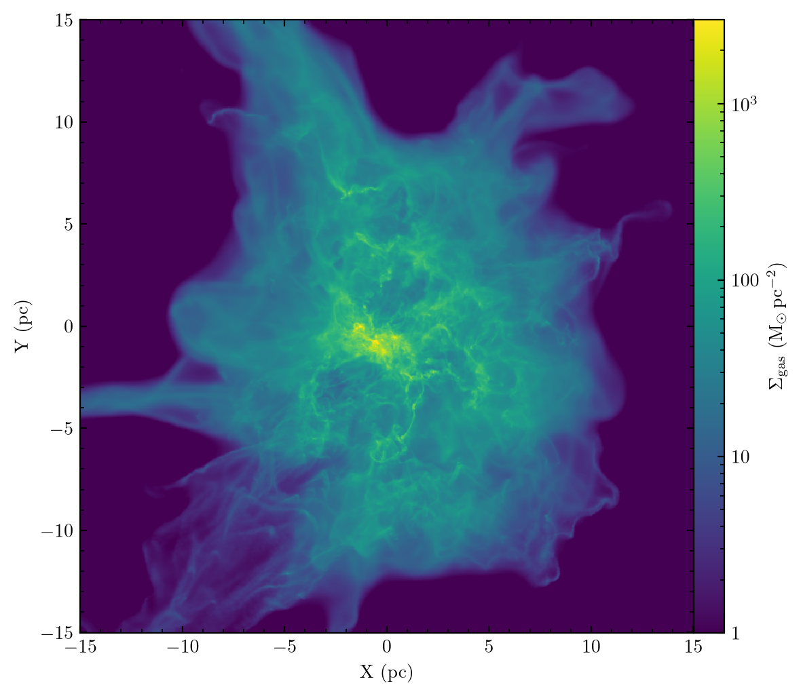
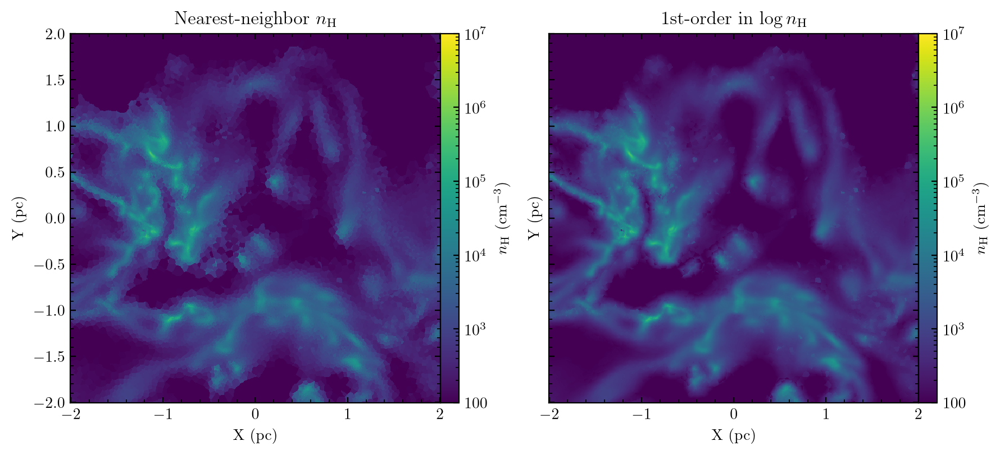
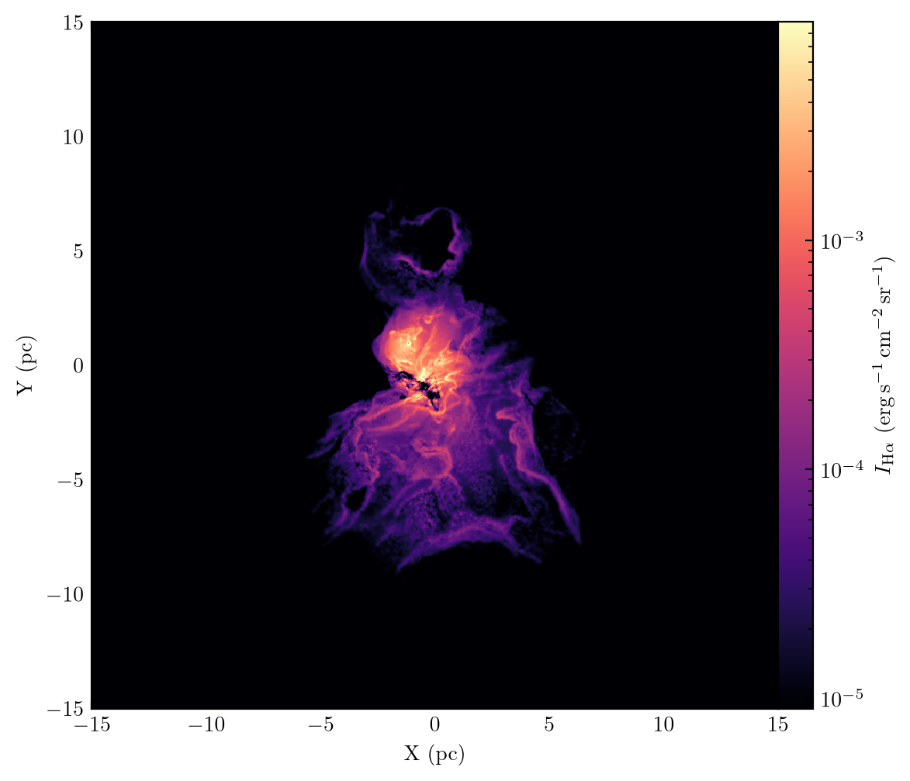
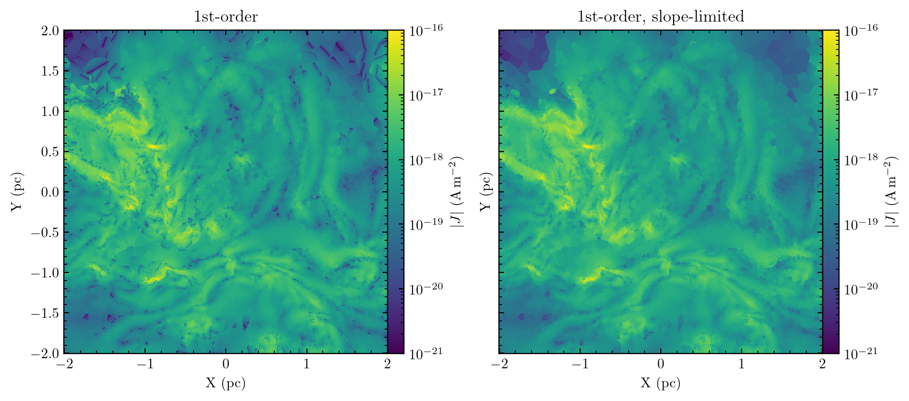

[](https://meshoid.readthedocs.io/en/latest/?badge=latest)

"It's not a mesh; it's a meshoid!" - Alfred B. Einstimes

Meshoid is a Python package for analyzing meshless particle data, performing such operations as density/smoothing length computation, numerical differentiation on unstructured data, and various kernel-weighted projection and averaging operations. It was originally designed to work with simulation data from the GIZMO code, but is totally agnostic to the actual format of the data it works on, so feel free to use it with your favorite meshless or unstructured mesh code!

# [Full Documentation](https://meshoid.readthedocs.io/en/latest/)

# Installation

Install from PyPI via `pip install meshoid` or pull this repo and run `pip install .` from the repo directory.

# Walkthrough

First let's import pylab, Meshoid, astropy units, and the load_from_snapshot function for loading
GIZMO outputs.


```python
from matplotlib import pyplot as plt
import matplotlib.colors as colors
from mpl_toolkits.axes_grid1 import make_axes_locatable
import numpy as np
import warnings
from astropy import units as u, constants as const
from meshoid import Meshoid, load_from_snapshot

# the raytracer below cannot cache its compiled kernel, which is harmless here
warnings.filterwarnings("ignore", message=".*Cannot cache compiled function.*")


# coordinates for a square map, for pcolormesh
def grid(halfwidth, res):
    a = np.linspace(-halfwidth, halfwidth, res)
    return np.meshgrid(a, a, indexing="ij")


%matplotlib inline
```

Now let's load some of the gas data fields from a snapshot in the public STARFORGE data release
using load_from_snapshot. This one is a $2\times10^4 M_\odot$ giant molecular cloud that has
turned ~800 $M_\odot$ of gas into stars, resolved with 23.7M gas cells - so you will want a few GB
of RAM.


```python
from os.path import isfile
from urllib.request import urlretrieve

SNAPNUM = 2590
SNAPFILE = f"snapshot_{SNAPNUM}.hdf5"
RUN = "M2e4_R10_Z1_S0_A2_B0.1_I1_Res271_n2_sol0.5_42"
URL = (
    "https://users.flatironinstitute.org/~mgrudic/starforge_data/STARFORGE_RT/"
    f"STARFORGE_v1.2/M2e4_R10/{RUN}/output/{SNAPFILE}"
)

if not isfile(SNAPFILE):  # feel free to use your own snapshots instead!
    print(f"downloading {SNAPFILE} (3.1 GB), this will take a while...")
    urlretrieve(URL, SNAPFILE)
```

GIZMO records its unit system in the snapshot header, so read it instead of assuming - this run
stores velocities in m/s, not the more usual km/s. Attaching astropy units means every conversion
from here on gets checked for us.


```python
header = lambda key: load_from_snapshot(key, 0, ".", SNAPNUM)

unit_length = header("UnitLength_In_CGS") * u.cm
unit_mass = header("UnitMass_In_CGS") * u.g
unit_velocity = header("UnitVelocity_In_CGS") * u.cm / u.s
unit_density = unit_mass / unit_length**3
assert header("ComovingIntegrationOn") == 0 and header("HubbleParam") == 1  # no h or a factors

pos = load_from_snapshot("Coordinates", 0, ".", SNAPNUM) * unit_length
mass = load_from_snapshot("Masses", 0, ".", SNAPNUM) * unit_mass
hsml = load_from_snapshot("SmoothingLength", 0, ".", SNAPNUM) * unit_length
rho = load_from_snapshot("Density", 0, ".", SNAPNUM) * unit_density

# hydrogen mass fraction from the abundances this run adopted (index 0 is total
# metallicity, 1 is helium); per-cell values are in the Metallicity dataset
X_H = 1 - header("Solar_Abundances_Adopted")[:2].sum()
n_H = (rho * X_H / const.m_p).to(u.cm**-3)

boxsize = header("BoxSize") * unit_length
center = np.repeat(0.5, 3) * boxsize
print(f"{len(mass):,} gas cells totalling {mass.sum().to(u.Msun):.0f} in a {boxsize.to(u.pc):.0f} box")
```

    23,682,804 gas cells totalling 23941 solMass in a 100 pc box


## Projections

OK, now let's start by making a map of gas surface density. We can do so by generating a Meshoid
object from the particle masses, coordinates, and smoothing lengths, and then calling the
SurfaceDensity method. This function is useful for giving kernel-weighted projected quantities on
a Cartesion grid of sighlines.

Meshoid can also adaptively compute particle smoothing lengths on-the-fly provided only the
coordinates, but it requires a nearest-neighbor search that takes a while so it's best to provide
the smoothing length when you can. Meshoid works on plain arrays, so we strip units going in and
put them back on the result.


```python
M = Meshoid(pos.to_value(u.pc), mass.to_value(u.Msun), hsml.to_value(u.pc))

RMAX = 15.0
RES = 800
X, Y = grid(RMAX, RES)

sigma_gas = (
    M.SurfaceDensity(M.m, center=center.to_value(u.pc), size=2 * RMAX, res=RES) * u.Msun / u.pc**2
)

fig, ax = plt.subplots(figsize=(6, 6))
p = ax.pcolormesh(X, Y, sigma_gas.value, norm=colors.LogNorm(vmin=1, vmax=3e3))
divider = make_axes_locatable(ax)
cax = divider.append_axes("right", size="5%", pad=0.0)
fig.colorbar(p, label=r"$\Sigma_{\rm gas}$ $(\rm M_\odot\,pc^{-2})$", pad=0, cax=cax)
ax.set_aspect("equal")
ax.set_xlabel("X (pc)")
ax.set_ylabel("Y (pc)")
plt.tight_layout(h_pad=1)
plt.show()
```


    

    


The same deposition will run on an NVIDIA GPU with `backend="cuda"` (`pip install meshoid[cuda]`),
where `dtype` picks the precision - `float32` is ~10x faster than `float64` on consumer cards,
which run double precision at 1/64 rate, and both agree with the CPU result to summation-order
roundoff. Every call has to convert and upload the particle arrays though, a fixed cost that does
not care about resolution, so the GPU wins by more the bigger the map is and may not beat 32 CPU
threads on a small one.


```python
import time
from meshoid.gpu_deposition import cuda_available


def time_call(*args, **kwargs):
    t0 = time.time()
    result = M.SurfaceDensity(*args, **kwargs)
    return result, time.time() - t0


if cuda_available():
    M.SurfaceDensity(M.m, center=center.to_value(u.pc), size=2 * RMAX, res=64, backend="cuda")  # warm up JIT
    for res in (RES, 2048):
        kwargs = dict(center=center.to_value(u.pc), size=2 * RMAX, res=res)
        sigma_cpu, t_cpu = time_call(M.m, **kwargs)
        print(f"res = {res}:  cpu {t_cpu:.2f}s", end="")
        for dtype in (np.float64, np.float32):
            sigma_gpu, dt = time_call(M.m, backend="cuda", dtype=dtype, **kwargs)
            err = np.abs(sigma_gpu - sigma_cpu)[sigma_cpu > 0] / sigma_cpu[sigma_cpu > 0]
            print(f" | {np.dtype(dtype).name} {dt:.2f}s ({t_cpu / dt:.1f}x, med. rel. diff {np.median(err):.0e})", end="")
        print()
else:
    print("no CUDA device here - install meshoid[cuda] on a machine with an NVIDIA GPU")
```

    res = 800:  cpu 1.01s

     | float64 1.67s (0.6x, med. rel. diff 1e-15)

     | float32 1.18s (0.9x, med. rel. diff 8e-07)


    res = 2048:  cpu 4.10s

     | float64 3.30s (1.2x, med. rel. diff 1e-15)

     | float32 1.56s (2.6x, med. rel. diff 8e-07)


## Slices

Now let's look at the 3D gas density in a slice through the cloud, using the Slice method. This
will reconstruct the data to a grid of points in a plane slicing through the data. You can chose
the order of the reconstruction: 0 will simply give the value of the nearest particle (i.e.
reflecting the Voronoi domains), 1 will perform a linear reconstruction from that particle, etc.
The best order will depend upon the nature of the data: smooth data will look best with
higher-order reconstructions, while messier data will have nasty overshoots and artifacts.

Slices and derivatives need a tree, which scales with the number of cells, so we zoom in on the
central 4pc where the stars have formed.


```python
L_ZOOM = 4.0 * u.pc
in_zoom = np.all(np.abs(pos - center) < L_ZOOM / 2, axis=1)
print(f"{in_zoom.sum():,} cells in the central {L_ZOOM:.0f}")

M = Meshoid(
    pos[in_zoom].to_value(u.pc), mass[in_zoom].to_value(u.Msun), hsml[in_zoom].to_value(u.pc)
)

RES_ZOOM = 600
X, Y = grid(L_ZOOM.value / 2, RES_ZOOM)
slice_kwargs = dict(center=center.to_value(u.pc), size=L_ZOOM.value, res=RES_ZOOM)

n_H_cgs = n_H[in_zoom].to_value(u.cm**-3)
n_H_slice = M.Slice(n_H_cgs, order=0, **slice_kwargs)
# order must be given explicitly: it defaults to 0, and at 0th order the log
# round-trip is the identity, so both panels would be the same picture
n_H_slice_log = 10 ** M.Slice(np.log10(n_H_cgs), order=1, **slice_kwargs)

fig, ax = plt.subplots(1, 2, figsize=(9, 4.5), sharex=True, sharey=True)
norm = colors.LogNorm(vmin=1e2, vmax=1e7)
for a, img, title in zip(
    ax, (n_H_slice, n_H_slice_log), (r"Nearest-neighbor $n_{\rm H}$", r"1st-order in $\log n_{\rm H}$")
):
    p = a.pcolormesh(X, Y, img, norm=norm)
    a.set(xlabel="X (pc)", ylabel="Y (pc)", aspect="equal", title=title)
    divider = make_axes_locatable(a)
    cax = divider.append_axes("right", size="5%", pad=0.0)
    fig.colorbar(p, label=r"$n_{\rm H}$ $(\rm cm^{-3})$", cax=cax)
fig.tight_layout()
plt.show()
```

    1,742,705 cells in the central 4 pc


    

    


## Simple Radiative Transfer

Meshoid is also capable of performing radiative transfer with a known emissivity/source function
and opacity, neglecting scattering. This is possible because there is a direct analogy between
doing a line-integral through a density field (as in the projection above), and solving the
time-independent radiative transfer equation.

For example, we can compute the H$\alpha$ emissivity of the ionized gas, and calculate the
dust-extincted H$\alpha$ surface brightness of the HII region the stars have carved out. For
case-B recombination the emissivity per unit volume is $n_e n_p
\alpha^{\rm eff}_{{\rm H}\alpha}(T) E_{{\rm H}\alpha}$; `ElectronAbundance` and `HII` are both
stored as fractions per hydrogen nucleus. radtransfer wants an emissivity per unit mass, so we
divide by density - and since it forms $j/\kappa$ internally, the two have to use the same mass
unit.


```python
from meshoid.radiation import radtransfer, dust_abs_opacity

WAVELENGTH_HALPHA = 656.28 * u.nm

n_e = load_from_snapshot("ElectronAbundance", 0, ".", SNAPNUM) * n_H
n_p = load_from_snapshot("HII", 0, ".", SNAPNUM) * n_H
T = load_from_snapshot("Temperature", 0, ".", SNAPNUM) * u.K

# effective Halpha recombination coefficient - not the total case-B rate, since
# only ~46% of recombinations yield an Halpha photon (Draine 2011 eq. 14.8),
# with T clipped to the range the fit is meant for
T4 = (T / (1e4 * u.K)).to_value(u.dimensionless_unscaled).clip(0.05, 10)
alpha_halpha = 1.17e-13 * T4 ** (-0.942 - 0.031 * np.log(T4)) * u.cm**3 / u.s
E_halpha = (const.h * const.c / WAVELENGTH_HALPHA).to(u.erg)

emissivity = (n_e * n_p * alpha_halpha * E_halpha).to(u.erg / u.s / u.cm**3)
# radtransfer applies the 1/4pi itself and forms j/kappa, so j must be an
# emissivity per unit mass in the same mass unit as kappa
j_halpha = (emissivity / rho).to(u.erg / u.s / u.Msun)
kappa_dust = dust_abs_opacity(WAVELENGTH_HALPHA.to_value(u.micron)).to(u.pc**2 / u.Msun)
print(f"L(H-alpha) = {(j_halpha * mass).sum().to(u.Lsun):.3g}, kappa = {kappa_dust:.2e}")

# j and kappa are shape (N, num_bands) - any number of bands can be solved at once
intensity = radtransfer(
    np.atleast_2d(j_halpha.value).T,
    mass.to_value(u.Msun),
    np.atleast_2d(np.repeat(kappa_dust.value, len(mass))).T.clip(1e-100),  # we divide by kappa
    pos.to_value(u.pc),
    hsml.to_value(u.pc),
    RES,
    2 * RMAX,
    center.to_value(u.pc),
) * u.erg / u.s / u.pc**2 / u.sr  # code units in, code units out
intensity = intensity.to(u.erg / u.s / u.cm**2 / u.sr)

X, Y = grid(RMAX, RES)
fig, ax = plt.subplots(figsize=(6, 6))
img = intensity[:, :, 0].value
# let the ionized core saturate, which brings out the ionization fronts
p = ax.pcolormesh(X, Y, img, norm=colors.LogNorm(vmin=img.max() / 1e4, vmax=img.max() / 10), cmap="magma")
ax.set_aspect("equal")
divider = make_axes_locatable(ax)
cax = divider.append_axes("right", size="5%", pad=0.0)
fig.colorbar(p, label=r"$I_{{\rm H}\alpha}$ $(\rm erg\,s^{-1}\,cm^{-2}\,sr^{-1})$", cax=cax)
ax.set_xlabel("X (pc)")
ax.set_ylabel("Y (pc)")
plt.show()
```

    L(H-alpha) = 2.31e+03 solLum, kappa = 1.38e-02 pc2 / solMass


    

    


## Differential Operators

Now let's play around with Meshoid's numerical differentiation. Meshoid can take both first
(Meshoid.D) and second derivatives (Meshoid.D2) on unstructured data, using a kernel-weighted (or
unweighted) least-squares gradient estimator.

As a first sanity check, we can try differentiating the coordinate functions, with respect to
those coordinates. That ought to return an identity matrix. Note that you can differentiate
scalars, vectors, or even arbitrary tensors that are defined on the meshoid. In general,
differentiating a tensor of rank N will return a tensor of rank N+1.

The first time a given differentiation method is called, Meshoid can take a minute to compute the
weights that it needs. Hang in there, Meshoid is working diligently and will re-use those weights
the next time you need a derivative!


```python
M.D(pos[in_zoom].to_value(u.pc))
```


    array([[[ 1.00000000e+00, -5.98207322e-18, -5.63005599e-17],
            [ 1.18654409e-17,  1.00000000e+00, -6.69356885e-17],
            [-7.55550675e-17, -1.26660907e-16,  1.00000000e+00]],
    
           [[ 1.00000000e+00, -9.58413098e-18, -1.61634303e-17],
            [ 5.47558021e-17,  1.00000000e+00,  3.47128521e-16],
            [-4.15690537e-17,  7.23695820e-17,  1.00000000e+00]],
    
           [[ 1.00000000e+00,  5.28217287e-18, -5.07719205e-17],
            [ 3.17954796e-17,  1.00000000e+00, -4.71575684e-17],
            [-8.81584216e-18, -8.42632572e-17,  1.00000000e+00]],
    
           ...,
    
           [[ 1.00000000e+00, -7.50398331e-18, -2.79194729e-18],
            [ 1.30798141e-17,  1.00000000e+00, -5.76998226e-17],
            [ 1.00981929e-17, -1.25402684e-16,  1.00000000e+00]],
    
           [[ 1.00000000e+00,  3.09318095e-17, -7.53792279e-19],
            [ 1.27842454e-17,  1.00000000e+00, -1.17667952e-17],
            [-5.55925596e-17, -7.94038005e-17,  1.00000000e+00]],
    
           [[ 1.00000000e+00, -5.21491985e-17, -2.56195776e-17],
            [-1.08587435e-17,  1.00000000e+00,  3.22073861e-17],
            [ 2.57684777e-17,  5.71089168e-18,  1.00000000e+00]]],
          shape=(1742705, 3, 3))


OK now let's look at something physical. Let's calculate the current density
$\mathbf{J} = \nabla \times \mathbf{B} / \mu_0$, which this snapshot gives us in Tesla. We only
need the field in the zoom region, and load_from_snapshot will read just those cells if we hand it
a particle mask.

Differentiating a vector gives `dB[i,j,k]` $= \partial B_j / \partial x_k$, so we can assemble the
curl from those components by hand - or just call `Curl`, which does exactly that.


```python
B = (
    load_from_snapshot("MagneticField", 0, ".", SNAPNUM, particle_mask=np.arange(len(mass))[in_zoom])
    * u.T
)
print(f"median |B| = {np.median(np.linalg.norm(B, axis=1)).to(u.uG):.1f}")

dB = M.D(B.to_value(u.T))  # dB[i,j,k] = d(B_j)/d(x_k), in T/pc
curl_B = np.c_[
    dB[:, 2, 1] - dB[:, 1, 2],
    dB[:, 0, 2] - dB[:, 2, 0],
    dB[:, 1, 0] - dB[:, 0, 1],
]
print("matches Curl():", np.allclose(curl_B, M.Curl(B.to_value(u.T)), rtol=1e-12, atol=0))

J = (np.linalg.norm(curl_B, axis=1) * u.T / u.pc / const.mu0).to(u.A / u.m**2)
print(f"median |J| = {np.median(J):.2e}")
```

    median |B| = 53.1 uG


    matches Curl(): True
    median |J| = 3.22e-18 A / m2


`|J|` is positive by construction, so any negative pixel in a reconstruction of it is an
overshoot. A plain 1st-order reconstruction produces them on a few percent of pixels around sharp
features, which show up as dark speckle. Passing `slope_limiter=True` applies the Barth-Jespersen
limiter, which shrinks each gradient until the reconstructed values stay within the range spanned
by the cell's neighbours - that removes most of the overshoot while keeping the interpolation.


```python
J_slice = M.Slice(J.value, order=1, **slice_kwargs)
J_slice_limited = M.Slice(J.value, order=1, slope_limiter=True, **slice_kwargs)
for name, img in ("order=1", J_slice), ("slope_limiter=True", J_slice_limited):
    print(f"{name:>18}: {100 * np.mean(img < 0):.2f}% of pixels overshoot to negative |J|")

X, Y = grid(L_ZOOM.value / 2, RES_ZOOM)
fig, ax = plt.subplots(1, 2, figsize=(9, 4.5), sharex=True, sharey=True)
norm = colors.LogNorm(vmin=1e-21, vmax=1e-16)
for a, img, title in zip(ax, (J_slice, J_slice_limited), ("1st-order", "1st-order, slope-limited")):
    p = a.pcolormesh(X, Y, np.abs(img), norm=norm, cmap="viridis")
    a.set(xlabel="X (pc)", ylabel="Y (pc)", aspect="equal", title=title)
    divider = make_axes_locatable(a)
    cax = divider.append_axes("right", size="5%", pad=0.0)
    fig.colorbar(p, label=r"$|J|$ $(\rm A\,m^{-2})$", cax=cax)
fig.tight_layout()
plt.show()
```

               order=1: 3.14% of pixels overshoot to negative |J|
    slope_limiter=True: 0.13% of pixels overshoot to negative |J|


    

    

